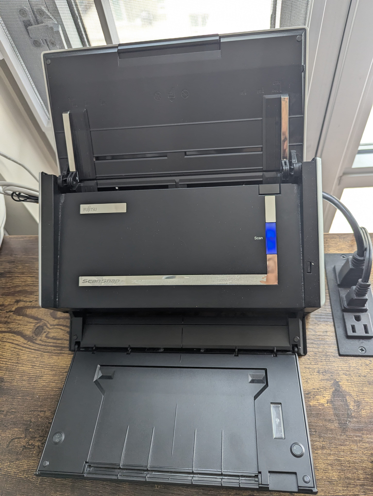
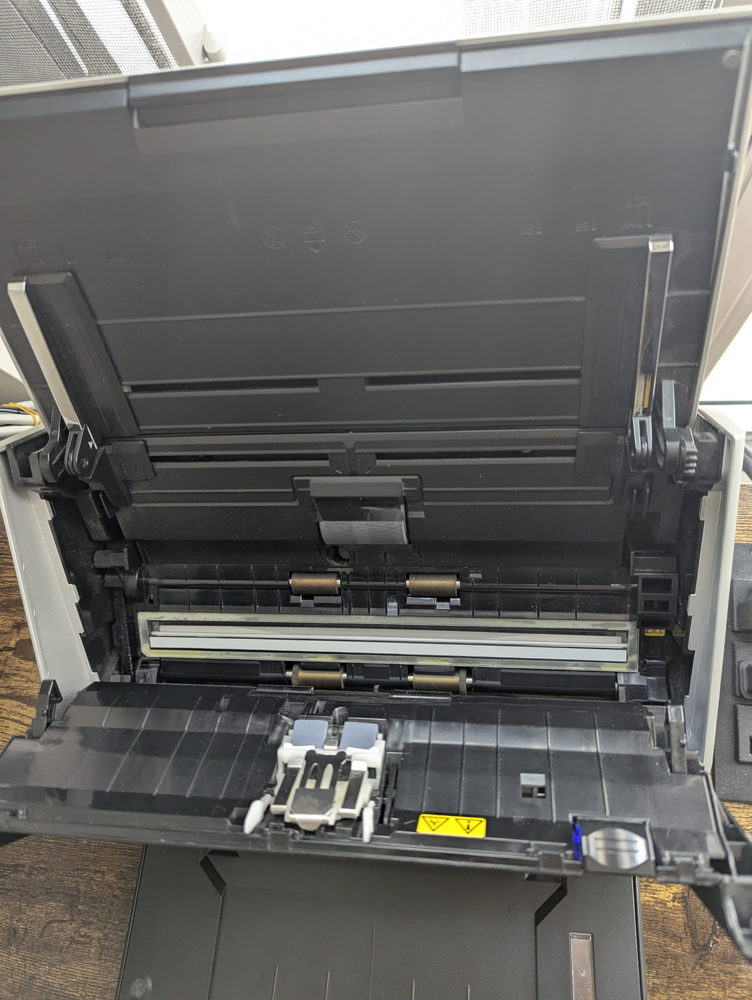
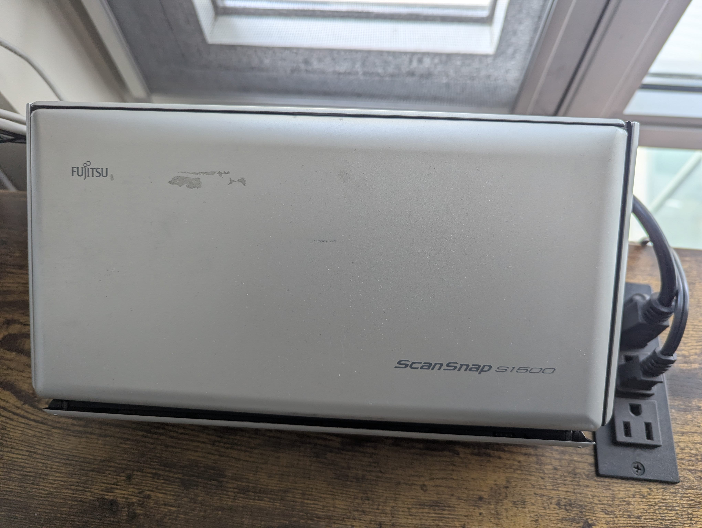

# scan-station

[](https://github.com/whizzzkid/scan-station/actions/workflows/release.yml)

Headless Scanning Server For Fujitsu ScanSnap and Similar Devices.

## The Device, ScanSnap

These are pretty cheap to find used, I brought mine for CA$5 from a [local electronics recycler](https://retail.era.ca).

| | |
| --- | --- |
| [Wikipedia Entry](https://en.wikipedia.org/wiki/List_of_Fujitsu_image_scanners) | [](https://upload.wikimedia.org/wikipedia/commons/c/c7/Scansnap_S1500_001_%285460070526%29.jpg)|
| [Fujitsu ScanSnap S1500 Front](./assets/ScanSnap_S1500_Front.jpg) | [](./assets/ScanSnap_S1500_Front.jpg) |
| [Fujitsu ScanSnap S1500 Rear](./assets/ScanSnap_S1500_Rear.jpg) | [](./assets/ScanSnap_S1500_Rear.jpg) |
| [Fujitsu ScanSnap S1500 Internal](./assets/ScanSnap_S1500_Internal.jpg) | [](./assets/ScanSnap_S1500_Internal.jpg) |
| [Fujitsu ScanSnap S1500 Closed](./assets/ScanSnap_S1500_Closed.jpg) | [](./assets/ScanSnap_S1500_Closed.jpg) |


This is a duplex scanner (scans both sides at once) with a gravity fed tray and has a scan button on the device to start scanning.

### The Problem

The scan button on the device does not trigger the scanning function, it instead just notifies an accompanying software which then initiates the scan. I think the software for windows and mac was available till 2024 and then the support was dropped, I don't even know if this works with the latest windows and mac machines. But what I want is a standalone scan server where I just load the tray, press scan and shred the documents while my document storage automatically ingests the scanned document and processes it for later use.

## Scan Station System

Standalone Headless Scanning system

### Hardware

Apart from the ScanSnap scanner, I hooked up a SBC-Computer card (with a USB 2.0 or higher port) I had lying around (no preference, get the cheapest one, RPi, ROCK*, OrDroid, etc.)

### Software

Almost all of my machines are built over [DietPi](https://dietpi.com/#download), even VMs, I use [simple script to manage docker containers](https://github.com/whizzzkid/sdm) running on DietPi. This allows me to update, prune and backup the entire system easily. I use `dietpi-software` to install `Docker` which is optimized for DietPi.

### Scanner Setup

The Device is now connected to SBC and is on, I can now create a `docker-compose.yaml` like so:

```yaml
services:
  scanner:
    image: ghcr.io/whizzzkid/scan-station:latest
    container_name: scanner
    hostname: scanner
    restart: always
    privileged: true
    volumes:
      - /ingest:/scans
      - /var/run/dbus:/var/run/dbus
```

don't forget to have the right mount path for `/ingest` this is just an example, for me this is a NFS mount. Then start the scanning system:

```sh
./run.sh -cupv   # based on the docker management script above, can be `docker compose up -d` too.
```

## Scan

Load the docs to be shredded (or scanned before) in the tray and press the button. The first time it ran I was excited, it goes through so quickly and does both sides too. WOW!

This is way faster than my HP Flatbed and my phone camera scanner, time to cleanup all those pesky papers I have laying around.

## Customization

### Scanning

The [scan.sh](./scan.sh) script is all what it takes to scan the page, this is based on [sane-scan-pdf](https://github.com/rocketraman/sane-scan-pdf).

You can configure the DPI and Mode settings in the `docker-compose.yaml`:

```yaml
    environment:
      - dpi=120       # defaults to 300
      - mode=Gray     # defaults to 'Color'
```

Or, if you want more flexibility, you can probably create your custom script and overlay in the docker compose like:

```yaml
...
    volumes:
      - ./your-custom-scan.sh:/etc/scanbd/scripts/scan.sh
...
```

### Non-Fujitsu Scanners

The [sane-scan-pdf](https://github.com/rocketraman/sane-scan-pdf) project is built around Fujitsu scanners, but there is a possibility to provide a custom device.

So `docker-compose.yaml` can be modified to have a vendor (this defaults to `fujitsu`)

```yaml
    environment:
      - vendor='Non-Fujitsu'
```

## Document Management

There are plenty of self-hosted solutions for document management available, two popular ones are [paperless-ngx](https://github.com/paperless-ngx/paperless-ngx) and [papra](https://github.com/papra-hq/papra), either should work till these can ingest from the same NFS share and have the document ready to be served.

## Acknowledgements

- https://github.com/ep1cman/fujitsu-ix1300-scan-on-button inspiration for this work.
- https://github.com/rocketraman/sane-scan-pdf makes scanning so simple.

## License

MIT
